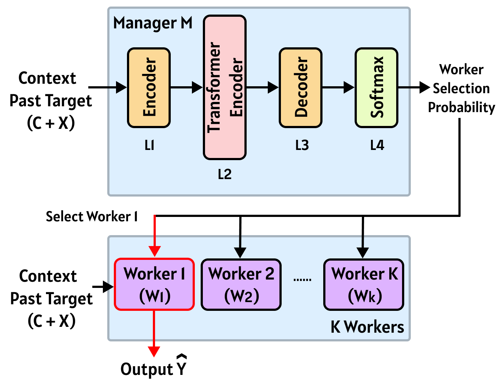
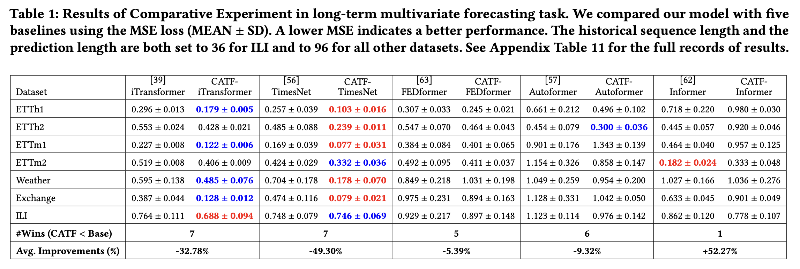
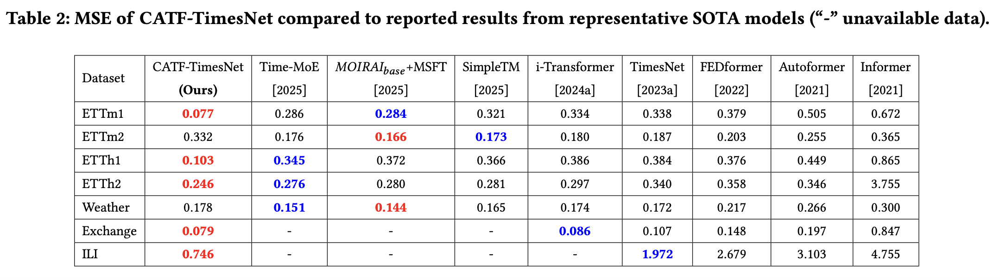

# CATF: A Manager-Worker Framework for Context-Aware Multivariate Time-Series Forecasting

CATF is a flexible framework built upon a manager–worker architecture for multivariate time-series forecasting. It enables specialized learning across different context patterns and improves predictive performance over standard baselines. This repository provides implementations of standard baseline models for multivariate time-series forecasting, as well as their enhanced versions using our proposed CATF framework.

<p align="center">
  
</p>

*Figure 1: Manager Worker Architecture.*

## Environment Setup

Create and activate a virtual environment:
```
python3 -m venv venv && source venv/bin/activate
```

Install all required dependencies:
```
pip install -r requirement.txt
```

## Training

### Run a Baseline Model:
To train a standard baseline model on a specific dataset:
```
python train_et_model.py —config cap/configs/baseline/<dataset>/config_<dataset_lower_case>_<model>.yaml
```
Replace `<dataset>` and `<model>` with the abbreviations of the values.
`<dataset>` includes: ETTh1, ETTh2, ETTm1, ETTm2, exchange, illness, weather;
`<model>` includes: Informer (`<info>`), Autoformer (`<auto>`), EFDFormer (`<fed>`), TimesNet (`<times>`), i-Transformer (`<it>`)

### Run CATF-`<baseline>`:
To train CATF-enhanced variants of the baselines:
```
python train_et_catf.py --config cap/configs/cap/<dataset>/et_cap_<model>.yaml
```

### Run multiple times (with GPU selection and output saving):
```
python run_multiple_times.py --command "export CUDA_VISIBLE_DEVICES=<GPU_Number> && python train_et_catf.py --config cap/configs/cap/<dataset>/et_cap_<model>.yaml" --times <number of experiments> --save-output
```

Example:
``` 
python run_multiple_times.py --command "export CUDA_VISIBLE_DEVICES=0 && python train_et_catf.py --config cap/configs/cap/ETTh1/et_cap_times.yaml" --times 10 --save-output
```

## Results

### CATF vs Baseline
We compare CATF-enhanced models (CATF-Baselines) with their original counterparts across multiple benchmark datasets. 

  
*Figure 2: CATF vs. baseline models across multiple datasets.*

### CATF-TimesNet vs. Recent SOTA Models

  
*Figure 3: CATF-TimesNet vs. recent state-of-the-art models.*


## Repository Structure
```
CATF/
├── cap/                        # Core package containing all modules (CAP stands for Context-Aware Prediction)
│   ├── configs/                # YAML configuration files (for baselines and CATF models)
│   ├── data/                   # Data loading and preprocessing utilities
│   ├── models/                 # Model architectures (baselines and catf)
│   │   └── catf.py             # CATF-specific model definitions
│   ├── training/               # Training logic and trainer classes
│   │   └── catf_trainer.py     # CATF training loop
│
├── run_multiple_times.py       # Script to run training multiple times with logging
├── train_et_catf.py            # Main training script for CATF
├── train_et_model.py           # Script for training baseline models
├── requirement.txt             # Python package dependencies
├── README.md                   # Project documentation (you are here)
```


<!-- ## Pypi Package Implementation

## Installation

```bash
pip install cap
```

## Quick Start

### As a Python Package

```python
from cap import Transformer, FEDFormer, Autoformer, train_model, evaluate_model

# Initialize and train a model
model = train_model(
    train_loader=train_loader,
    valid_loader=valid_loader,
    input_dim=10,
    output_dim=1,
    seq_len=24,
    pred_len=12,
    model_type='transformer'
)

# Evaluate the model
test_loss = evaluate_model(model, test_loader, model_type='transformer')
```

### From Command Line

```bash
# Get help
cap --help

# Train a model
cap train --model transformer --data input.csv --output model.pt --epochs 10 --lr 0.001

# Make predictions with a trained model
cap predict --model transformer --data input.csv --model-path model.pt --output predictions.csv
```

## Available Models

- Transformer
- FEDFormer
- Autoformer
- TimesNet
- Informer
- LSTM

## Training

The framework provides a unified training interface for all models:

```python
from cap import train_model

# Train a model
model = train_model(
    train_loader=train_loader,
    valid_loader=valid_loader,
    input_dim=input_dim,
    output_dim=output_dim,
    seq_len=seq_len,
    pred_len=pred_len,
    hidden_dim=128,  # for LSTM
    num_layers=2,    # for LSTM
    epochs=10,
    lr=0.001,
    patience=5,      # early stopping patience
    device='cuda',   # or 'cpu'
    model_type='lstm'  # or 'transformer', 'autoformer', 'informer', 'fedformer'
)
```

## Evaluation

Models can be evaluated using the provided evaluation function:

```python
from cap import evaluate_model

# Evaluate a model
test_loss = evaluate_model(
    model=model,
    test_loader=test_loader,
    device='cuda',
    model_type='lstm'
)
```

## Configuration

Models can be configured using YAML configuration files:

```yaml
model:
  type: transformer
  hidden_size: 512
  num_layers: 6
  num_heads: 8
```

## Requirements

- Python >= 3.8
- PyTorch
- Other dependencies listed in requirements.txt

## License

MIT License
 -->
